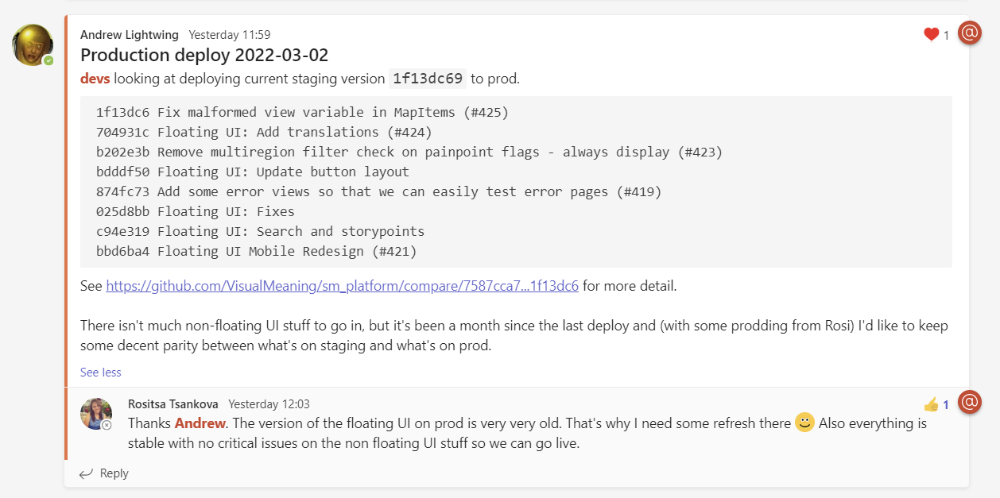
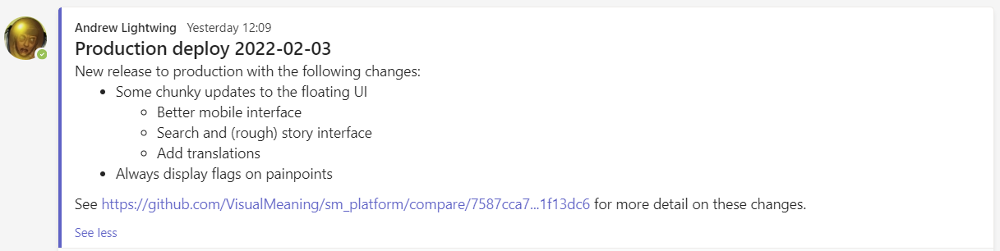

# Production deploys of the Shared Meaning Platform

This document outlines our process and steps for deploying the Shared Meaning Platform to our Production environment in Heroku.

## Development process prior to a production deploy

We have two environments running SMP code in Heroku, Staging and Production. Staging is a non-customer-facing environment that is identical to Production in terms of hardware and configuration, and is intended for pre-release testing of the code in a Production-like environment before deploying it to Production itself.

### Local development

The SMP code lives in the [sm_platform](https://github.com/VisualMeaning/sm_platform) repository. Our development process for `sm_platform` runs as follows:

- Developer forks `sm_platform`, clones the fork to their local machine and creates a new development branch.
- Developer runs and develops code on their local machine. There are instructions for how to set up a local dev environment in the `sm_platform` readme.
- Once the code is ready for testing, it is committed to the development branch and the development branch is pushed back up to the fork repository.
- A pull request for the development branch is then made against the `master` branch of the main `sm_platform` repository.
- The pull request is peer-reviewed and approved by at least one other developer. 
    - Once approval has been given, minor/suggested bugfixes can be made against the development branch without re-review. 
- The development branch is merged into `master`.
- The new `master` is deployed to Staging.

### Deploying to to the Staging environment

Our Staging environment can be found at https://staging.ecosystem.guide.

Staging runs as a Heroku app called `shared-meaning-staging`. You will need access to this app in order to deploy to the Staging environment. Ask Martin Packman or Andrew Lightwing if you do not have this access.

Heroku apps have built in CI/CD processes. Code is deployed by pushing the master branch of `sm_platform` to a git repository hosted on Heroku. Heroku will then automatically detect the new code, use that code to build a new container (or dyno, in Heroku-speak), and deploy the container to Staging.

To deploy code you will need to edit your git config for `sm_platform` so that it knows about the Heroku staging repository. From inside `sm_platform`, open up `.git/config` in a text editor and add the following config block:

```
[remote "staging"]
        url = https://git.heroku.com/shared-meaning-staging.git
        fetch = +refs/heads/*:refs/remotes/staging/*
```

Once the config is saved, the code can be deployed via a simple `git push` command.

```
git push staging master
```

The deploy will take a couple of minutes. While you are waiting, it is good practice to let others on the development team know you are doing a staging deploy via a post to the Technical channel under Software Development in Teams.

### Testing on the Staging environment

The Staging environment is tested daily by QA, both to specifically check the completion/robustness of newly developed features and to generally check the integrity of the environment. Any issues identified by QA are logged as bugs in Productive and addressed by Development via new deploys to Staging.

An important point is that **Staging is not guaranteed to work**. Developers should do a basic amount of checking in their local environment before deploying new code to Staging, but Staging is where the testing part of our development process formally occurs and so it's very possible that broken code could get deployed to Staging at any time. This is expected and normal, and as long as the bugs are found and fixed before they are deployed to production it means everything is working as intended.

## Deploying to the Production environment

Our Production environment can be found at https://eom.ecosystem.guide.

Ideally, Production deploys happen **weekly** to maintain close parity between Staging and Production.

Our deployment process for Production is very similar to the process for Staging, but with some extra steps for visibility and to make sure we don't ship broken code.

### Plan your production deploys in advance

Production deploys are relatively quick to execute from the development side but require time from QA for sanity checking. If you are intending to do a production deploy this should be surfaced in the daily check-in to make sure that QA has available capacity.

### Get a summary of the changes and post to the Technical channel in Teams

The first step is to figure out exactly what we are deploying. The SMP surfaces the commit hash of the code deployed to that environment in the bottom-right corner of the [About splash](https://eom.ecosystem.guide/maps/bucks-strategy/introduction) on every map. By getting the hash for Staging and the hash for Production we can get git to give us just the commits that happened between the last production deploy and the current Staging version.

```
git log <production hash>...<staging hash> --oneline --no-merges
```

This will provide a nice condensed summary of the changes. You can also get more detailed information out of Github by going to `https://github.com/VisualMeaning/sm_platform/compare/<production hash>...<staging hash>` (see [example here](https://github.com/VisualMeaning/sm_platform/compare/7587cca7...1f13dc6)).



Make a post to the Technical channel in Teams, tagging `@devs` for visibility to the Development team, and which includes the following:

- The words "Production deploy" in the header along with the date - this makes it easy to find these posts later.
- The short hash of the Staging version that you want to deploy to production
- The condensed summary of the commits/changes from the `git log` command above
- The Github link above that provides a more detailed summary of the changes.

Once this post has been made **there should be no further deploys to Staging until the production deploy is complete** -- the environment needs to be stable so that QA can test the specified Staging version.

### Wait for QA to sanity check the Staging environment

Once QA (Rosi) is notified that the candidate version is ready for testing on Staging they will do a basic saniy check to make sure there are no showstoppers. When is check is completed, QA will respond to the Teams post in Technical describing the production deploy with one of two outcomes:

- Everything is fine and the production deploy can go ahead, **or**,
- There are one or more bugs that are potential blockers for a release to Production.

If there are bugs, then Development will review and make a judgement call:

- If the bugs are easily fixable then this can be done on the day and a new Staging version can be pushed that *only* contains the fix. QA can retest the broken feature to confirm the fix, and if all is well the production deploy can continue.
- If the bugs are not easily fixable on the day then the production deploy should be postponed until such time as they are. Fixing bugs that block production deploys should be treated as high priority and addressed ASAP.

### Deploy to Production

Once Development and QA have both signed off on the Staging version it can be deployed to the Production environment. 

Just as with the Staging deploy, you will need access to the Heroku app that runs Production (which is called `shared-meaning`) and to configure your git setup for `sm_platform` so that it knows about the associated git repository. From inside `sm_platform`, open up `.git/config` in a text editor and add the following config block:

```
[remote "production"]
        url = https://git.heroku.com/shared-meaning.git
        fetch = +refs/heads/*:refs/remotes/production/*
```

Then you can push to production:

```
git push production master
```

(This assumes that the tip of your local `master` is still the same as what you earlier pushed to Staging. If it is not, then you'll have to look up the syntax for pushing a specific commit corresponding to the current Staging version.)

### Post to the Product channel with a notification of the new release to production

The `Technical` channel is mostly intended for communication internal to the Development team. Now that we've actually pushed a new version of the SMP to production, we need to notify the wider company.



Make a post to the `Product` channel under `Software Development`, including the following information:

- The words "Production deploy" in the header along with the date.
- A human-readable summary of the major changes in this release, *not* the full commit log. You don't need to include every bugfix and it's fine if this is just one or two bullet points.
- The Github link with the diff between the two versions so that people can click through for further information if they want it.
